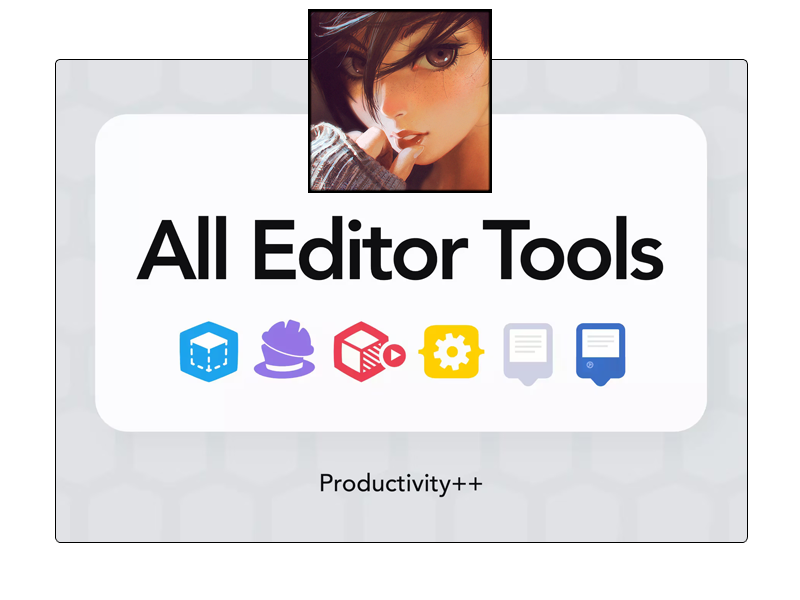

<div align="center">

```ocaml
NUNCA OMITIR / IGNORAR / EVITAR LEERME
```

</div>

<h1 align="center">
  <br>
  <a href="https://github.com/MOON-TYPE/moon-type"></a>
  <br>
  Moon-Type
  <br>
</h1>

<h4 align="center">Repositorio base de Moon-Type. Contiene todos los repositorios centralizados de <a href="https://github.com/MOON-TYPE/moon-type" target="_blank">Moon-Type</a>.</h4>

<p align="center">
  <a href="https://trello.com/w/typemoon1">
    
  </a>
  <a href="https://unity.com/">
    
  </a>
  <a href="https://github.com/Nervelink/nvs">
    
  </a>
</p>

<pre align="center">
  <a href="#descargar">DESCARGAR</a> • <a href="#colaboradores">COLABORADORES</a> • <a href="#licencia">LICENCIA</a>
</pre>
<h1>
  <a href="#--------">
  </a>
</h1>

<p align="center">
  <sup>
      
      <sup>
            Español,
            <a href="./README.md">Ingles</a>,
            <a href="./README.md">Chino (中文)</a>
      </sup>
  </sup>
</p>

<p align="center">
  
</p>

<p align="center">
  <em>Lista de herramientas en el repositorio <a href="https://github.com/MOON-TYPE/moon-type">Moon-Type</a>.</em>
</p>

## :octocat: ‎ <sup><sub><samp>¡HOLA! ¡GRACIAS POR VENIR!</samp></sub></sup>


Este repo contiene todos los repositorios de MOON-TYPE. Son herramientas generales y basicas para el editor de Unity Engine. Desde el seguimiento de codigo con etiquetas hasta librerias con extensiones.

La herramientas son las siguientes:

La mayoría fueron escritos desde cero. Algunos detalles:
- **MTODO** : [Mtodo](https://github.com/MOON-TYPE/mtodo) es una herramienta sencilla para hacer un seguimiento del codigo en Unity Engine. (Visual Studio/ Rider soportado)
- **MDev** : [Mdev](https://github.com/MOON-TYPE/mdev) es una consola, para Unity Engine, con la que puedes llamar a comandos predefinidos anteriormente y llamarlos en tiempo de ejecucion.
- **MLib** : [MLib](https://github.com/MOON-TYPE/mlib) es una libreria para Unity Engine con extensiones utiles de diversos campos.
- **MIcaros** : [MIcaros](https://github.com/MOON-TYPE/micaros) es una herramienta para facilitar la construccion de elementos ScriptableObjects en Unity Engine.
- **MDoc** : [MDoc](https://github.com/MOON-TYPE/mdoc) Es una herramienta para crear documentacion rapida, simple y en el editor de Unity Engine.
- **MJerarquia** : [MJerarquia](https://github.com/MOON-TYPE/mjerarquia) controla la jerarquia de Unity Engine agregando nuevas funcionalidades.

<div align="center">

```ocaml
CLIC O TOQUE ❲☰❳ PARA VER EL ESPEJO
```

</div>
<p align="right">
  [<a href="https://gitlab.com/type-moon/moon-type#">espejo</a>]
</p>             |
  
## <samp>Descargar</samp>

| Nombre                                                                                                 | Licencia |
|:-----------------------------------------------------------------------------------------------------------|:------------------------------|
| MTODO                      | [Repositorio](https://github.com/MOON-TYPE/mtodo)    |
| MDev                      | [Repositorio](https://github.com/MOON-TYPE/mdev)    |
| MLib                      | [Repositorio](https://github.com/MOON-TYPE/mlib)    |
| MIcaros                      | [Repositorio](https://github.com/MOON-TYPE/micaros)    |
| MDoc                      | [Repositorio](https://github.com/MOON-TYPE/mdoc)    |
| MJerarquia                      | [Repositorio](https://github.com/MOON-TYPE/mjerarquia)    |

  
## <samp>Colaboradores</samp>

1. ¡Bifurcalo!
2. Crea tu rama de características: `git checkout -b nueva-funcion`
3. Confirme sus cambios: `git commit -am 'Agregar funcionalidad'`
4. Empuje la rama: `git push origin nueva-funcion`
5. Envíe una pull request: D

El proyecto esta mantenido por [N9+](https://github.com/ninpl) con ayuda de los colaboradores ([lista](hhttps://github.com/MOON-TYPE/moon-type/graphs/contributors)).

<a href="https://github.com/MOON-TYPE/moon-type/graphs/contributors">
  
</a>

## <samp>Agradecimientos</samp>

|                  |       | Inspiración y Recursos                               |      |                               Licencia                               |
| :--------------: | :---: | :--------------------------------------------------- | :--- | :------------------------------------------------------------------: |
|      Imagen      |   1   | [Kevin Hong](https://www.kevinhong.com/ffvii-church) |      | [CC BY-NC-SA 4.0](https://creativecommons.org/licenses/by-nc-sa/4.0) |
| contributors-img |   2   | [Suguru Inatomi](https://github.com/lacolaco)        |      |                             Sin Licencia                             |
|     Shields      |   3   | [Thaddée Tyl](https://github.com/espadrine)          |      | [CC0 LICENSE](https://github.com/badges/shields/blob/master/LICENSE) |

## <samp>Politica de seguridad</samp>

[Leer](./SECURITY.md).

## <samp>Licencia</samp>

<pre align="center">
  <a href="https://github.com/MOON-TYPE/moon-type/blob/master/LICENSE">MIT</a> • <a href="https://ninpl.com">ninpl.com</a> • <a href="https://github.com/ninpl">@ninpl</a>
</pre>

<pre align="center">
  <a href="#readme">VOLVER ARRIBA</a>
</pre>
